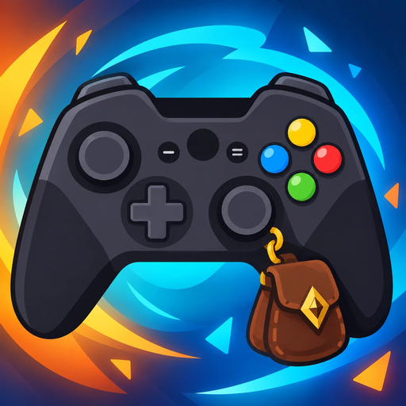

# Easy Controller - Forever

*Formerly Controller Keyboard.*

**WoW Forever's gamepad play, made easy**, without changing the game's own gamepad UI: a **chat
keyboard** with word prediction, a **gamepad mapping** (the gamepad bar's slots, game functions on
the free buttons and back paddles), and **quest** helpers. RB + D-pad down opens the configuration.

The **gamepad keyboard** types in **WoW Forever**'s chat, with **smartphone-style word prediction**
that learns the way you write. Two input methods: a **daisywheel** and a **split keyboard** (one half per stick).
Everything is also clickable with the mouse, so it works with the Steam Controller trackpad too.

The look follows WoW Forever's gamepad UI: bronze and gold rims, Friz Quadrata font, the game's own
button icons.

Besides the keyboard, a few quality of life modules for gamepad players: a **gamepad mapping**
window that adds the missing game functions (run / walk, game menu...) on the free buttons and the
**back paddles** without changing WoW Forever's own gamepad UI, **quest items** marked "do not sell",
and **quest links** in the chat. Each module can be turned off in the options.

## Languages

The interface is translated into English, French, German, Spanish and Italian, following the game
client's language. Suggestions and keyboard layout also follow it by default: a German client gets
QWERTZ and the German dictionary.

## Installation

1. Download the repository (*Code > Download ZIP*) and extract it, or grab the zip from CurseForge.
2. Rename the folder to **`EasyController`** (exact name) and put it in
   `World of Warcraft/_classic_beta_/Interface/AddOns/`.
3. **Fully restart the game** after installing or updating (`/reload` does not load new files).

## Gamepad

The keyboard opens by itself with the chat. It is disabled in combat (the game blocks too many
actions there, "Not possible in combat") and comes back after combat if the chat is still open.

Choose the input method in the options or with `/ec mode wheel|stick`.

### Common to both methods

| Button | Action |
|---|---|
| A | send the message (secure macro `/s`, `/y`, `/p`, `/g`… following the channel, or a direct whisper) |
| B | empty the message; with an empty message, B is the game's own and closes the chat |
| D-pad ↓ / ↑ | go to the channel row / back to the suggestions |
| D-pad ← → | move in the active row: suggestion, or chat channel |
| Right stick click | suggestions row: insert the suggestion; channel row: confirm the channel and go back to the suggestions |

**X** (channels), **Y** (tab settings), **Start** and **Select** stay with the game's gamepad UI.

### Daisywheel

```
            [a b c d]
   [. , ? !]         [e f g h]
 [y z ' -]     (•)     [i j k l]
   [u v w x]         [m n o p]
            [q r s t]
```

- **Left stick**: pick a petal.
- **Right stick**: flick toward the letter to type (left / top / right / bottom of the petal).
- **Left stick centered**: the right stick moves in the active row (← →), ↑ inserts the suggestion,
  ↓ deletes.

| Button | Action |
|---|---|
| LB | delete (hold to repeat) |
| RB | space |
| LT | shift (tap = one capital, double tap = caps lock) |
| RT or left stick click | numbers, accents and symbols |

### Split keyboard

A full keyboard (AZERTY, QWERTY, QWERTZ, Spanish QWERTY with ñ or Italian QWERTY; option or
`/ec layout azerty|qwerty|qwertz|es|it`), with a numbers / accents / symbols layer whose accents follow
the language (é è à ç… / ä ö ü ß / á é í ó ú ñ ¿ ¡ / à è é ì ò ù), cut in two halves: the **left stick** drives a cursor on
the left half (columns 1-5), the **right stick** on the right half (columns 6-10). Each stick's
**tilt is its cursor's position** around the center of its half: released, the cursor is at the
center; push fully to reach an edge or a corner. The keys near the middle of the keyboard are at the
edge of their half, so they are easy to hit. A line links each center to its cursor; a magnet keeps
the highlight from flickering. Keys over the middle (Space) belong to both halves.

| Button | Action |
|---|---|
| Left stick / right stick | move the left / right cursor (absolute position) |
| LT / RT | type the left / right cursor's key (one pull = one letter) |
| LB | delete (hold to repeat) |
| RB | space |
| Left stick click | numbers, accents and symbols |

Shift is the keyboard's own Shift key (tap = one capital, double tap = caps lock). The suggestions
and channels are driven with the D-pad.

Options: layout, stick dead zone, stick response (linear, gentle, fast), magnet strength, cursor
lines. Pick a larger window size in the options if the keys feel small.

## Mouse / Steam Controller

Every letter, suggestion and action (Shift, 123, Space, Delete, Send, X) is clickable. The game's
gamepad UI closes the chat on the first click: the keyboard then stays open and keeps the message,
"Send" sends it to the chat channel and "X" closes the keyboard.

## Chat channels

A row under the keyboard shows `/s`, `/y`, `/p`, `/ra`, `/g`, `/1`, `/w`, `/r` in their channel
colors. You have to reach for it, so you never switch by mistake: press **D-pad ↓** to make it the
active row, then **D-pad ← →** (or the right stick in the daisywheel); **D-pad ↑** goes back to the
suggestions. With the mouse, simply **hover** a channel (no click needed). The message is then sent
there with A. Unavailable channels are greyed out and skipped (party / raid / guild you are not in,
`/r` with nobody to reply to). Switching never loses the chat focus.

The chosen channel also becomes the chat's own sticky channel, as if you had typed `/p` in the
game: every following message goes there, including text typed on a physical keyboard or by a
dictation tool, and the keyboard reopens on it. Only the channel is set, never the chat's text, and
never in combat; this can be turned off in the options.

With `/w`, first pick the recipient: type the name (names may contain a space) and insert a
suggestion (recent correspondents, group members, online friends, guild) or press A to confirm what
you typed; then type the message. Deleting on an empty message goes back to the name.

## Quest links and drafts

- The channel row ends with a **Quests** chip: select it to turn the suggestions row into the list of
  your quests, then insert one with the right stick click.
- Links inserted with **Shift+click**, or with the game's own **Share in chat** (gamepad quest log:
  Y > Share in chat), go into the keyboard's message.
- When the game closes the chat (another panel opens, combat), the message is kept as a **draft**
  and comes back with the chat: type "LFM", open the quest log, share the quest, and the keyboard
  holds "LFM [quest]". B empties it as usual; a draft is dropped after 10 minutes.
- Backspace deletes a link as a whole.

## Configuration panel

**RB + D-pad down** opens the addon's own panel (only watched, never bound: the game's own buttons stay as they are;
the General tab learns any other pair: press A on it, then hold a button and press a second one;
also `/ec config`, a
key binding, or *Options > AddOns > Easy Controller - Forever*). It is driven with the gamepad (LB / RB:
tabs, D-pad: move and change values, A: choose, B: close) or the mouse.

- **General**: every function, each with its own switch (keyboard, auto-open, quest links,
  Shift+click links, drafts, sticky channel, quest item tooltip / sale warning / merchant warning,
  gamepad mapping, extra buttons on screen, RB + D-pad down), button icons and font.
- **Keyboard**: size, position, input method, layout, sticks, prediction.
- **Gamepad**: the mapping below.
- **Vibrations**: the controller vibrations below.
- **Supplies**: the supplies buttons below.
- **Wheel**: the consumables wheel below.

## Gamepad mapping

The Gamepad tab (`/ec map`) shows the whole controller, in its four trigger layers: alone, LT, RT,
LT + RT (hold the triggers, or click the layer tabs).

- **The game's own buttons stay as they are.** They are shown with what they do and its icon: jump,
  interact, back, inspect, targeting, Start menu...
- **The gamepad bar's slots** (D-pad and A / B / X / Y in the four layers, but the fixed jump /
  interact / back / inspect) take a spell, an item or a macro: press A on one, pick it, and it goes
  in the game's own slot, like with its action bar editor (X empties it).
- **The free inputs get the missing functions**: L3 / R3, trigger combinations nothing is bound to
  (LT + Start...) and the back paddles. Press A on one and pick, with LB / RB for the tabs:
  - **Game**: run / walk, autorun, game menu, map, bags, character, spellbook, quest log, open the
    keyboard... then every key binding of the game, by its own categories;
  - **Spells**, **Items** (usable ones in your bags), **Macros**;
  - **Bar**: press a button of the gamepad action bar ("LT + RT A"...).
- X removes, B goes back / closes. Everything is clickable with the mouse too.

### Back paddles (L4 / R4 / L5 / R5) and extra buttons

For the Steam Deck and other controllers with back paddles: set each paddle to a keyboard key in
Steam Input (F13 to F16 for example), then **Identify the back paddles** (under the controller) asks
you to press each one in turn; B skips a paddle your controller doesn't have. Y on one paddle learns
it again. `/ec keys` lists the keys the game receives. Controllers whose paddles the game sees
directly (PADPADDLE1-4) work as they are.

The paddles have the four layers: alone, LT, RT, LT + RT. A trigger that is not a keyboard modifier
in the game's gamepad settings (RT, by default) doesn't change the key a paddle sends: RT + L4 is the
same key as L4. The addon then reads the triggers when the paddle is pressed, from the game's
secure code, and runs that layer's **spell, item or macro**. A game function (run / walk, map...) is
a key binding and needs a key of its own: on such a layer, turn on **"RT acts as a modifier"**
(General tab), or the layers share it.

L3 / R3 can be shown too (General tab), with what the game does with them (autorun, ping...) or what
you put on them. Spells are listed with their rank.

The extra buttons that do something (back paddles, L3, R3) appear around the gamepad action bar, in
its round slot style: the action's icon, count, cooldown and usability, the held trigger layer's
action, and the game's pressed look when you press them. **Place the bar and extra buttons** moves the game's gamepad bar by steps with the D-pad (only its
place on the screen changes, out of combat; X puts it back; the extra buttons follow it), and puts each
extra button
on one of the fixed places around the bar's controls (two columns on the outer side, two rows above and
two below): the D-pad chooses the bar or a button (LB / RB too), A picks it up, then the D-pad moves it
(a button goes from place to place, onto a taken place the two buttons swap), A puts it down and B puts
it back; the mouse clicks a button then a place; the right side mirrors the left (Y turns it
off), X puts a button back. Places follow the compact layout.

## Vibrations

The controller vibrates on the game events you choose (Vibrations tab): one switch and one intensity
for all, then each event with its own box and its own pattern (micro tick, tick, double tick, pulse,
long, heartbeat, crescendo) or Off, all with the D-pad; A or the Test button plays it, X turns it
on or off.

- **Combat**: low health (a heartbeat, faster below 20 %), big hit taken, death, your spell
  interrupted (by someone, not by moving), loss of control, aggro, entering combat, spell proc,
  action impossible.
- **Social**: whisper, group or raid invite, ready check, resurrection or summon, trade or duel.
- **Progress**: level up, quest objective or quest complete, rare loot, bags full, gear almost broken.
- **Easy Controller**: a key typed on the chat keyboard.

Only the two standard motors are used, so any controller the game drives vibrates. WoW Forever may
hide your exact health from addons in combat: low health and big hit then cannot work, and the tab
says so. `/ec vibe [pattern]` tells what the client allows and plays a pattern.

## Supplies

One round button per resource, in the gamepad bar's style (Supplies tab):

- **free bag slots** (quivers, ammo pouches and soul bags apart), the **equipped ammunition**, the
  **class reagents** (soul shards, infernal stones, arcane powder, runes, candles, symbols, seeds,
  ankhs, poisons, powders...) once you carry them, and **any item** added from your bags;
- the count, and under the **low threshold** a glow that grows stronger, faster and redder down to
  the **critical threshold**; each resource can be turned off, its thresholds set with the D-pad;
- the bar is **placed freely**: dragged with the mouse while unlocked, or moved with the D-pad
  ("Move with the D-pad"), growing right, left, down or up, in 3 sizes; a click opens the bags
  (through the game's own backpack button);
- low supplies and little room left can vibrate (Vibrations tab).

## Consumables wheel

A key of its own opens a wheel of up to 12 consumables from your bags: food, drink, healing and
mana potions, healthstone, mana gem, bandages (used on yourself), buff food, elixirs and flasks,
scrolls. The best of each kind comes first, then the other variants you carry (an option); each
kind can be left out (Wheel tab).

- Give it a key in the Gamepad tab (Items list: any free button, or a back paddle in any layer) or
  in *Escape > Key Bindings > AddOns*.
- **Hold its key, aim with the right stick, let the key go**: the item aimed is used (the stick in
  the middle: nothing). A quick press keeps it open: aim, then A or the key again. **B** cancels;
  the D-pad and the mouse work too. While it is open it takes the sticks, like the game's own
  wheels: the camera and the character stay still. (In combat an addon only sees key presses and
  releases, never the stick moving: the use comes with the key's release, not the stick's.)
- It sits in the middle of the screen (unlocked, drag the open wheel with the mouse, or move it with
  the D-pad from the Wheel tab).
- It works **in combat**: the wheel and the keys it takes are secure, run by the game. Food and drink
  are greyed there (the game forbids them in combat). Its content is updated out of combat only (a
  rule of the game).
- Moving from slot to slot can vibrate (Vibrations tab).

## Quest items

Item tooltips show an orange **"Quest item: do not sell"** line on quest items, including the items a
quest asks to collect (cloth, ore, meat...) that the game itself does not mark: for those, the line
names the quest. In the bags they get the border the game puts on its own quest items, in orange
(the game's own quest items keep theirs). Selling one to a
merchant shows a warning with a reminder of the Buyback tab; with the gamepad bag tooltips turned
off, selecting one at a merchant warns too.

## Prediction

- **Word completion**: English, French, German, Spanish and Italian dictionaries of 12,000 words
  each, plus WoW slang (lfg, heal, dungeon…). Defaults to the client's language, changeable in the
  options (or French + English). Accents are ignored
  while searching: `ca` suggests "ça", `ete` suggests "été".
- **Next word, iPhone style**: your usual message starters as soon as the chat opens; after each word,
  the most likely next word from your own 2 and 3 word sequences, plus built-in common French phrases.
- **Slash commands**: a message starting with `/` suggests `/reload`, `/p`, `/ra`, `/g`, `/w`, then your
  most used commands and common ones (`/r`, `/roll`, `/dance`, `/ec lock`…).
- **Learning**: every message you send (gamepad or keyboard) feeds your words, message starters, word
  sequences and commands. The text after `/w`, `/g`… is never stored as a command. Everything stays
  local, in `WTF/.../SavedVariables/EasyController.lua`.

## Options

In the configuration panel (RB + D-pad down, `/ec config`):

- every function on or off (General tab);
- input method (daisywheel / split keyboard), keyboard layout (AZERTY / QWERTY), stick dead
  zone, stick response (linear, gentle, fast), magnet, cursor lines;
- lock position, open automatically, only when the gamepad is active;
- keyboard size: small (80 %), normal, large (125 %), extra large (150 %) — `/ec scale` for any
  other value; invert the sticks vertical axis, show / hide the mouse buttons row;
- font (Blizzard fonts: Friz Quadrata, Morpheus, Skurri, Arial Narrow, or the chat font);
- button style (Xbox / PlayStation) and the game's button icons;
- suggestion language (French, English, German, Spanish, Italian, or French + English), learning;
- reset position, forget learned words.

## Commands

| Command | Effect |
|---|---|
| `/ec` | open the keyboard |
| `/ec lock` | lock / unlock the position (unlocking shows the keyboard to place it) |
| `/ec mode wheel\|stick` | daisywheel or split keyboard |
| `/ec layout azerty\|qwerty\|qwertz\|es\|it` | split keyboard layout |
| `/ec auto` | open automatically with the chat |
| `/ec pad` | only open automatically when the gamepad is active |
| `/ec learn` | turn learning on / off |
| `/ec lang fr\|en\|de\|es\|it\|both` | suggestion and accent language |
| `/ec scale 0.8` | keyboard size |
| `/ec invert` | invert the sticks vertical axis |
| `/ec reset` | reset the keyboard position |
| `/ec stats` | statistics |
| `/ec forget confirm` | forget learned words |
| `/ec config` | configuration panel (also RB + D-pad down) |
| `/ec map` | gamepad mapping (free buttons, back paddles) |
| `/ec keys` | list the keys and buttons the game receives (back paddles) |
| `/ec vibe [pattern]` | test the controller vibration |
| `/ec glyphs` | list the game's gamepad button icons |
| `/ec debug` | print received buttons and sticks |

**"Toggle keyboard"**, **"Easy Controller - Forever configuration"** and **"Gamepad mapping"** key bindings
are also available in *Escape > Key Bindings > AddOns*.

## Technical notes

- The addon never writes to the game's chat box: text set by an addon is tainted, and when the gamepad
  UI reads it back its own code gets blocked in combat, over and over until the client freezes. The
  message lives in the keyboard's bar and is sent through a secure macro button.
- WoW Forever's gamepad UI forbids addons from closing the chat or opening panels
  (`SetPreferredGamepadInteractTarget` error, which can freeze the client). The addon never closes the
  chat itself, creates its frames outside the gamepad UI's watch, and sends with the mouse through a
  secure macro button.
- Gamepad buttons are bound (override bindings) only while typing, and released before combat.
- The gamepad mapping never changes WoW Forever's gamepad UI. An input is "free" only when no game
  binding uses it (checked with ours removed); our bindings are plain override bindings of the
  addon's own frame, set out of combat while none of the game's gamepad windows has the focus, below
  the game's own window bindings, and set again when such a window closes. A paddle on a bar button
  is bound to a click on the game's button, which the game runs like its own D-pad and face buttons.
  The paddles on screen are plain frames that only read the game's buttons, so they update in
  combat.
- Quest items only add a line through the tooltip API and watch the buyback list; links and the
  chat's focus are followed through hooks and the game's own events, never by calling its chat code.
- B is bound only while the message holds text; the binding is removed when B is released, so with an
  empty message B goes back to the game, which closes the chat.
- Code layout: `Message.lua` is the common core (message, prediction, channels, sending),
  `Wheel.lua` and `StickKeyboard.lua` are the input methods, `UI.lua` the common panel, `Input.lua`
  the pad buttons and sticks; `ConfigWindow.lua` the configuration panel (`Options.lua` its General
  and Keyboard rows, `MapWindow.lua` its Gamepad tab); `Mapping.lua` / `Paddles.lua`,
  `QuestItems.lua` and `QuestLinks.lua` are the modules.

## Roadmap

What is planned next (consumables wheel, remapping the game's own buttons...) is in
[ROADMAP.md](ROADMAP.md).

## Development

Textures (PNG sources in `design/textures/`, converted to TGA for the game):

```bash
python tools/convert_textures.py
```

Dictionaries ([FrequencyWords](https://github.com/hermitdave/FrequencyWords) frequency lists,
OpenSubtitles):

```bash
python tools/build_dict.py fr    # or en, de, es, it
```

CurseForge / release package (`dist/EasyController-<version>.zip`, page description in
`docs/curseforge.md`):

```bash
python tools/package.py
```

### Releases

Releases are automatic (`.github/workflows/release.yml`): set the new `## Version` in the TOC, add a
`## <version>` section to `CHANGELOG.md`, commit, then push a tag `v<version>`:

```bash
git tag v1.0.0
git push origin v1.0.0
```

GitHub then checks that the tag matches the TOC, builds the zip, creates the GitHub release and uploads
the file to CurseForge, both with that version's CHANGELOG section as release notes. A tag with a dash
(`v1.1.0-beta1`) is a beta. It needs the `CF_API_KEY` repository secret (a CurseForge API token); the
CurseForge game version is 1.60.1 (WoW Forever) unless the `CF_GAME_VERSION` repository variable says
otherwise. CurseForge has no API for the project page itself: paste `docs/curseforge.md` there when it
changes.

## License

Code under the MIT license (see `LICENSE`). The `Dict_*.lua` word lists (French, English, German,
Spanish, Italian) are derived from FrequencyWords (Hermit Dave) and remain under the
[CC-BY-SA-4.0](https://creativecommons.org/licenses/by-sa/4.0/) license.

## AI disclosure

This addon was built with the help of AI: the code was written with Claude Code (Anthropic) and the
visual design created with Claude Design, directed by the author, who defined the features and tested
the addon in game.
